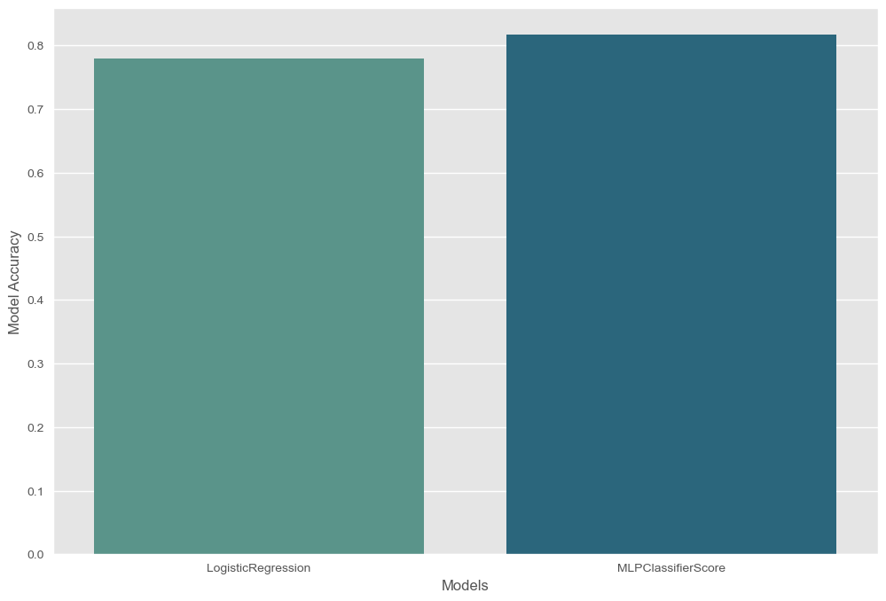

# Travel Insurance Prediction Model

## Project Overview

This project aims to develop a predictive model for an insurance company to determine whether a person will purchase travel insurance. The model is built using machine learning techniques, primarily focusing on the MLP (Multi-Layer Perceptron) classifier and Logistic Regression. 

### Problem Statement

The challenge involves designing a model that accurately predicts the likelihood of a customer purchasing travel insurance based on various factors. This model will assist the insurance company in understanding customer behavior and tailoring their services accordingly.

### Desired Outcomes

The project involves several key steps:

1. **Data Analysis and Preprocessing:** Initial exploration and preparation of the data to make it suitable for modeling.
2. **Model Development:** Utilizing MLP and Logistic Regression algorithms to develop the predictive model.
3. **Explanation and Evaluation:** Each step in the data analysis is explained, including the rationale behind the chosen methods. The performance of the models is evaluated using a confusion matrix and other relevant metrics.

## Repository Structure

- `HW2-4-v2.ipynb`: Jupyter notebook containing the entire analysis and model development process.
- `Q4.csv`: The dataset used for the analysis.
- `Report.pdf`: A PDF file containing a detailed report of the analysis and findings.

## Key Results

- The comparison between MLPClassifier and LogisticRegression in terms of accuracy is depicted in the notebook. 

- Insights on the best parameters and structure for MLP and other machine learning algorithms that yield the desired results are discussed.

## How to Use

- Clone the repository.
- Ensure you have Jupyter Notebook installed.
- Run `HW2-4-v2.ipynb` to view the analysis and results.

